# COBOL Converter API

## System Architecture

```mermaid
flowchart TB
    subgraph Input["📁 Source Files"]
        COBOL["COBOL"]
        CPY["Copybooks"]
        JCL["JCL"]
        PLI["PL/I"]
        REXX["REXX"]
        CA7["CA-7"]
        DCLGEN["DCLGEN"]
        PARMLIB["PARMLIB"]
        ASM["Assembly"]
    end

    subgraph PhaseA["🔧 Phase A: Parsing"]
        Parser["ParserService"]
        Summarizer["SummarizerService"]
        DepExtractor["DependencyExtractor"]
    end

    subgraph Artifacts["📂 Artifacts"]
        PA["parsed_outputs/"]
        FS["file_summaries.md"]
        DG["dependency_graph.md"]
    end

    Input --> Parser
    Parser --> PA
    PA --> Summarizer
    PA --> DepExtractor
    Summarizer --> FS
    DepExtractor --> DG

    style Input fill:#e1f5fe
    style PhaseA fill:#fff3e0
    style Artifacts fill:#f3e5f5
```

```mermaid
flowchart TB
    subgraph AnalystAgent["🤖 Phase B: Analyst Agent"]
        direction LR
        Analyst["AnalystService<br/>(LangGraph)"]
        
        subgraph ReadTools["Reading"]
            AT1["list_artifacts"]
            AT2["read_artifact"]
            AT3["grep_artifact"]
            AT9["search_docs (RAG)"]
        end
        
        subgraph WriteTools["Writing"]
            AT4["submit_catalog_entry"]
            AT5["submit_job_chain"]
            AT6["submit_overview"]
            AT7["submit_data_flow"]
            AT8["submit_gap"]
        end
    end

    subgraph AnalystInput["Input"]
        FS2["file_summaries.md"]
        DG2["dependency_graph.md"]
    end

    subgraph AnalystOutput["Output: system_context/"]
        FC["functionality_catalog.md"]
        JC["job_chains.md"]
        SO["system_overview.md"]
        DF["data_flows.md"]
        GP["gaps.md"]
    end

    AnalystInput --> Analyst
    Analyst --> ReadTools
    Analyst --> WriteTools
    WriteTools --> AnalystOutput

    style AnalystAgent fill:#e8f5e9
    style AnalystInput fill:#f3e5f5
    style AnalystOutput fill:#fff8e1
    style ReadTools fill:#e3f2fd
    style WriteTools fill:#fce4ec
```






## MLflow Tracing (Development)

To view LangChain/LangGraph traces:

1. Enable in `.env`:
   ```
   MLFLOW_ENABLED=true
   ```

2. Start MLflow UI:
   ```bash
   uv run mlflow ui --port 5000
   ```

3. Open http://localhost:5000
