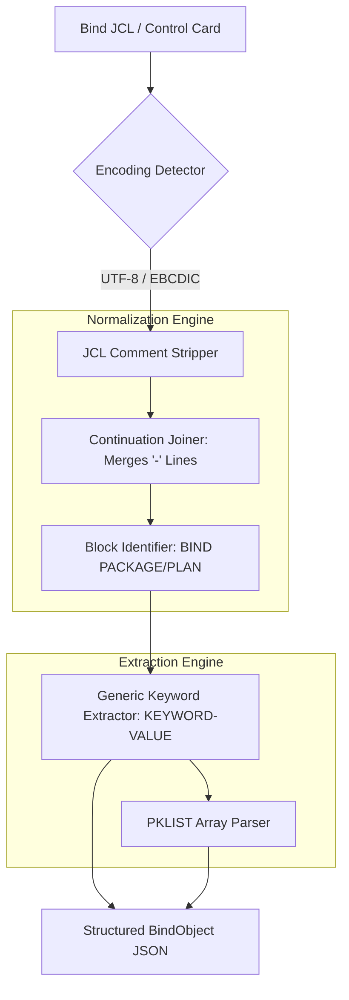

# DB2 Bind Control Files: Technical Analysis & Modernization Guide

## 1. Functional Overview & Business Purpose
In the IBM Mainframe world, DB2 interaction is governed by **Static SQL**. Unlike the dynamic SQL used in .NET, static SQL is pre-compiled and pre-authorized. The **Bind Control File** is a set of administrative commands that "binds" the COBOL SQL logic to the DB2 database engine.

### Core Purposes:
*   **The Optimizer's Map:** It tells the DB2 optimizer to analyze the SQL and decide which index to use *before* the program ever runs.
*   **Security & Authorization:** It defines which User ID (AuthID) is permitted to execute the specific SQL package.
*   **Concurrency Control:** It sets the "Isolation Level," which determines how many locks the program places on the database (balancing data integrity vs. speed).

## 2. Deep-Dive: Technical Architecture & Execution

### The "Static SQL" Lifecycle
1.  **Pre-compilation:** The COBOL compiler scans the source code. It pulls out every `EXEC SQL` statement and puts it into a binary file called a **DBRM (Database Request Module)**.
2.  **The Bind Step:** A JCL job runs the utility **IKJEFT01**. This utility reads the DBRM and the **Bind Control File**.
3.  **Access Path Generation:** DB2 reads the table statistics (RUNSTATS) and the SQL in the DBRM. It determines if it should do an "Index Scan" or a "Table Space Scan."
4.  **Catalog Storage:** The resulting execution plan is stored in the DB2 Catalog as a **Package** (single program) or a **Plan** (group of programs).

### Readability vs. Storage
*   **Control File:** **Readable Text.** It is essentially a JCL script.
*   **DBRM:** **Binary.** Not human-readable.
*   **Package/Plan:** **Binary structures** stored within the DB2 Subsystem.

### Execution Location
Execution happens within a TSO/E (Time Sharing Option) background address space. It requires a connection to a specific DB2 Subsystem (e.g., DB2P for Production).

## 3. Sample Input Snippet (Bind JCL)
The Bind Control file uses a unique "Continuation" syntax where a dash (`-`) indicates the command continues on the next line.
```jcl
//BINDPROC EXEC PGM=IKJEFT01
//SYSTSIN  DD *
  DSN SYSTEM(DB2P)
  BIND PACKAGE(FINANCE_COLL) -   /* Collection ID */
       MEMBER(PYPROG01) -        /* DBRM Name */
       ACTION(REPLACE) -         /* Overwrite existing */
       ISOLATION(CS) -           /* Cursor Stability (Locking) */
       QUALIFIER(FIN_PROD) -     /* Default Schema/Owner */
       RELEASE(COMMIT) -         /* When to release locks */
       EXPLAIN(YES)              /* Log the access path */
  END
/*
```

## 4. Parser Architecture (`BindParser`)
The `BindParser` is a normalization engine that converts JCL-based database configurations into a structured .NET configuration format.



### Parser Technical Strategies:

1.  **Continuation Pre-processing:** The `_preprocess_continuations` method is the heart of the parser. It ensures that `ISOLATION` on line 4 and `(CS)` on line 5 are joined into a single token.
2.  **Keyword Dictionary Mapping:** Instead of hardcoding keys, the parser uses a generic regex `PARAM_RE` to find all parenthetical values. This makes the parser "Future Proof" if new DB2 versions add more keywords.
3.  **EBCDIC Handling:** Uses a fallback mechanism to try multiple EBCDIC codepages (`cp1047`, `cp037`) to ensure no character loss during conversion.

## 5. Significance in .NET Modernization
Bind files are arguably the **most important** files for a Database Architect during migration to .NET.

*   **Qualifier → Schema Mapping:** In the mainframe, `QUALIFIER(FIN_PROD)` means the code can just say `SELECT * FROM TABLE1`. In .NET, your **Entity Framework (EF Core)** configuration must be set to the `FIN_PROD` schema, or the queries will fail.
*   **Isolation → Transaction Mapping:**
    *   `ISOLATION(CS)` (Cursor Stability) is similar to .NET's `ReadCommitted`.
    *   `ISOLATION(UR)` (Uncommitted Read) is similar to .NET's `ReadUncommitted` or `(NOLOCK)` hints.
    *   Failure to map these correctly will lead to **Deadlocks** or **Dirty Reads** in the new .NET system.
*   **Ownership:** The `OWNER` parameter identifies the security context. This must be mapped to a **Service Principal** or **Managed Identity** in Azure/AWS.

### Mainframe to .NET Capability Mapping
| Bind Parameter | .NET Equivalent | Transformation Detail |
| :--- | :--- | :--- |
| **QUALIFIER** | Default Schema | Set in `DbContext` or Connection String. |
| **ISOLATION** | `IsolationLevel` | Set in `TransactionScope` or `BeginTransaction()`. |
| **MEMBER** | C# Repository Class | Use to link SQL logic to the C# module. |
| **RELEASE** | Connection Pooling | Dictates when the connection is closed. |
| **EXPLAIN** | Query Plan / Stats | Use to generate Indexes in the new DB. |

## 6. Implementation Checklist for Migration
1.  **Inventory:** Identify every Bind JCL member in the production library.
2.  **Metadata Extraction:** Run the `BindParser` to generate a JSON "Database Manifest."
3.  **Schema Alignment:** Create schemas in SQL Server/PostgreSQL that match the parsed `QUALIFIER` values.
4.  **Transaction Strategy:** Review all `ISOLATION(RR)` (Repeatable Read) entries. These are "High Risk" and require special testing for concurrency issues in .NET.
5.  **Index Migration:** Use the `EXPLAIN(YES)` metadata to identify which columns were indexed on the mainframe and ensure matching indexes exist in the modern database.
6.  **Connection String Generation:** Use the `OWNER` and `SYSTEM` metadata to build environment-specific `appsettings.json` files.
