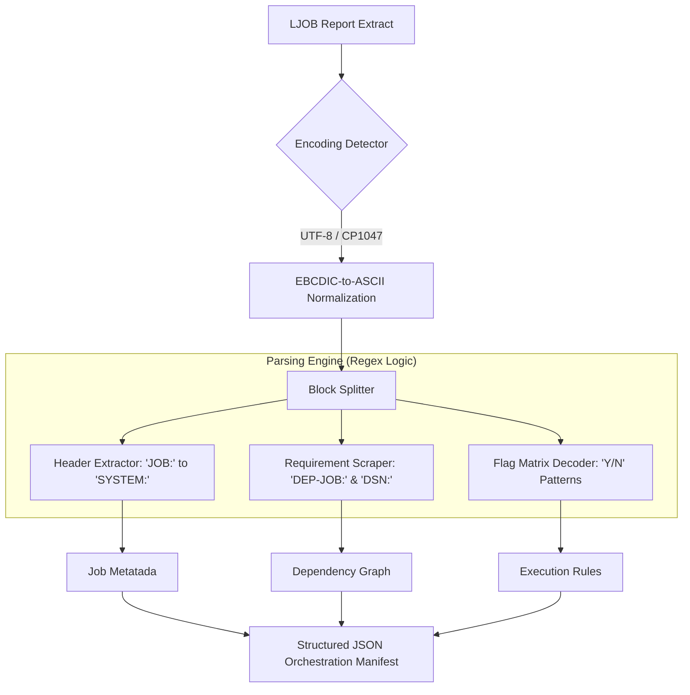

# CA-7 Workload Automation: Enterprise Technical Analysis & Modernization Guide

## 1. Functional Overview & Business Purpose
CA-7 is an enterprise-grade, real-time workload automation system that serves as the "Central Nervous System" for IBM Mainframe batch processing. Its primary objective is to manage the **Batch Window**—a critical period where high-volume data processing occurs without user intervention.

### Core Capabilities:
*   **Sequential Orchestration:** Manages multi-step business processes (e.g., "Calculate Interest" must follow "Post Transactions").
*   **Resource Management:** Prevents system overloads by limiting the number of simultaneous jobs based on available system initiators.
*   **Event-Driven Agility:** Responds to external stimuli, such as a file arriving from a vendor or a manual signal from an operator.
*   **Error Recovery:** Automated "Restart" logic that handles common system failures without manual intervention.

## 2. Deep-Dive: Technical Architecture & Execution
### Execution Environment
CA-7 operates as a **Started Task (STC)** on the z/OS operating system. It holds a high-priority status to ensure it can manage other jobs without lag. It interfaces directly with **JES (Job Entry Subsystem)** and **SMF (System Management Facilities)** to track job status.

### The Lifecycle of a CA-7 Managed Job
1.  **Requirement Scanning:** CA-7 continuously monitors its database for jobs whose "Time" or "Trigger" requirements are satisfied.
2.  **The Queue System:**
    *   **Request Queue:** The job is "loaded" but waiting for predecessors (Jobs or Datasets).
    *   **Ready Queue:** All requirements are met. The job is waiting for an available JES Initiator.
    *   **Active Queue:** The JCL has been submitted and is currently executing in a mainframe address space.
3.  **Submission:** CA-7 retrieves the JCL from a **PDS (Partitioned Dataset)**, performs variable substitution (symbolics), and submits it to the JES internal reader.
4.  **Tracking & Post-Processing:** Upon completion, CA-7 analyzes the **Completion Code**.
    *   If **RC=0000**, it marks the job as successful and releases successors.
    *   If the job **Abends (Abnormal End)**, CA-7 halts the chain and alerts the Operations Console.

### Readability vs. Storage
*   **Internal Storage:** CA-7 definitions are stored in a proprietary, high-performance VSAM database (Binary/Non-readable).
*   **Extraction for Analysis:** For migration/KT, we use the **LJOB command** via the Batch Terminal Interface (BTI). This produces a human-readable text report (ASCII/EBCDIC) containing the full dependency logic.

## 3. Sample Input Snippet (CA-7 LJOB Extract)
This report represents the "Logical View" of a job definition:
```text
JOB: PAYROLL1  SYSTEM: FINANCE  SCHID: 001  OWNER: PRODADM  CLASS: A
  ---------------------------------------------------------------------
  PREDECESSOR REQUIREMENTS:
  DEP-JOB: PREPAY01  (INTERNAL JOB DEPENDENCY)
  DEP-JOB: PREPAY02  (INTERNAL JOB DEPENDENCY)
  DSN: GL.PROD.INPUT.DATA (EXTERNAL DATASET TRIGGER)
  USR-REQ: VERIFY_CHECK_COUNT (MANUAL OPERATOR HOLD)
  
  EXECUTION OPTIONS:
  Y -- DONT CANCEL  (IF SYSTEM CRASHES, DO NOT PURGE)
  N -- MAINTAIN INDEX
  Y -- RESTARTABLE  (ELIGIBLE FOR CA-11 AUTOMATED RESTART)
  ---------------------------------------------------------------------
```

## 4. Parser Architecture (`CA7Parser`)
The `CA7Parser` is a Python-based engine designed to reverse-engineer the mainframe batch schedule into a modern JSON format.



### Parser Technical Strategies:
1.  **Regex Resilience:** Uses `re.IGNORECASE` and `(?m)` (multiline mode) to handle the varied spacing often found in mainframe print-spool reports.
2.  **Dependency Categorization:** The parser differentiates between **Job Dependencies** (sequential logic) and **Dataset Dependencies** (event-driven logic), which are treated differently in .NET.
3.  **Error Handling:** It captures "Unrecognized" lines to ensure that undocumented CA-7 parameters are flagged for manual review by the architect.

## 5. Significance in .NET Modernization
Migrating CA-7 is not about "installing a scheduler"; it is about **re-coding the workflow logic**.

*   **From JCL to Containers/Console Apps:** CA-7 used to submit JCL. In the new world, your orchestrator (ADF/Airflow) will trigger **Docker Containers, Azure Functions, or .NET Console Apps**.
*   **Dataset Triggers (Modernized):** In CA-7, a job waits for `GL.PROD.INPUT.DATA`. In .NET, this is replaced by an **Azure Blob Trigger** or **AWS S3 Event**. When the file lands, the cloud native "Event Grid" starts the pipeline.
*   **Predecessor Mapping:** The "Job-A leads to Job-B" logic is migrated to a **Directed Acyclic Graph (DAG)**. This ensures that the .NET Data Access Layer (DAL) only begins processing once the previous data-transformation step is validated.

### Mainframe to .NET Capability Mapping
| Mainframe CA-7 Feature | .NET / Cloud Equivalent | Transformation Logic |
| :--- | :--- | :--- |
| **DEP-JOB** | Pipeline Dependency | Map to "Wait for Completion" in ADF/Airflow. |
| **DSN Trigger** | Event-Driven Trigger | Map to Storage Account / S3 Event Notification. |
| **USR-REQ** | Manual Approval Gate | Map to CI/CD Gate or PowerAutomate Approval. |
| **SCHID** | Environment Variables | Use to toggle "Daily" vs "Monthly" C# logic. |
| **Abend Handling** | Retry Policy / DLQ | Define `maxRetryAttempts` in the .NET orchestrator. |

## 6. Implementation Checklist for Migration
1.  **Discovery:** Extract all LJOB reports for the entire application system.
2.  **Schema Generation:** Run the `CA7Parser` to generate a master JSON manifest of all job relationships.
3.  **DAG Visualization:** Use the JSON output to visualize the dependency tree (ensure no circular references).
4.  **Trigger Inventory:** Create a list of all external file dependencies (DSNs) and coordinate with the data migration team for "File Landing" zones.
5.  **Orchestration Build:** Programmatically generate ADF Pipelines or Airflow DAGs using the parsed JSON metadata.
6.  **SLA Validation:** Compare CA-7 "Average Run Times" against .NET benchmarks to ensure the "Batch Window" is maintained.


