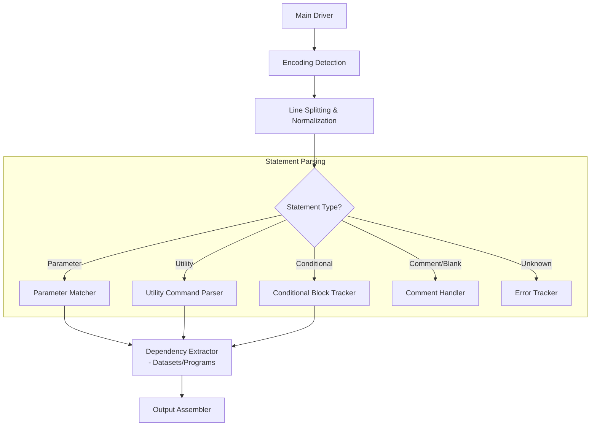

# PARMLIB Parsing Strategy & Architecture Guide

## 1. Overview
This document outlines the architectural decisions, technical challenges, and implementation strategies for parsing **PARMLIB** (Parameter Library) members in IBM z/OS mainframe environments. PARMLIB is a partitioned dataset (typically SYS1.PARMLIB) containing system initialization parameters, utility commands, and conditional logic used during IPL (Initial Program Load) and system configuration. These members are critical in legacy ingestion pipelines and mainframe modernization, often referencing datasets, programs, and subsystems that need mapping to cloud/.NET equivalents.

PARMLIB members configure aspects like system symbols (IEASYMxx), consoles (CONSOLxx), SMF (SMFPRMxx), and more. Accurate parsing is essential for reverse engineering system configurations, extracting dependencies, validating parameters, and enabling automated migration to modern orchestration tools (e.g., Ansible, Terraform, or Azure ARM templates).

The parser is designed to be robust, with features like EBCDIC detection, multi-line command handling, conditional block support, dependency extraction, error tracking, and migration insights, integrated into the broader mainframe modernization framework.

---

## 2. File Conventions

| File Type          | Common Extensions       | Description                                                                 | Key Characteristics |
|--------------------|--------------------------|-----------------------------------------------------------------------------|----------------------|
| **PARMLIB Member** | No extension (PDS members) | Individual members within SYS1.PARMLIB (e.g., IEASYSxx, SMFPRMxx).          | Fixed-length records (LRECL=80); EBCDIC-encoded; parameter assignments (KEY=VALUE); supports continuations and conditionals. |
| **User PARMLIB**   | No extension             | Custom datasets concatenated to logical PARMLIB (e.g., USER.PARMLIB).       | Similar to system members but for site-specific overrides; may include utilities like SORT/IDCAMS. |
| **RACF PARMLIB**   | No extension (IRRPRMxx)  | RACF-specific members (z/OS V2R3+).                                         | Subset for security config (e.g., database names); replaces older modules like ICHRDSNT. |

> **Note:** PARMLIB is a logical concatenation of datasets, not a single file. Members are often extracted as flat files for analysis. The parser must handle EBCDIC (e.g., CP037, CP1047) and detect valid content via keywords like "PARM=", "SORT", "IDCAMS".

---

## 3. Core Parsing Challenges

### A. Encoding Detection (EBCDIC vs ASCII/UTF-8)
*   PARMLIB members are typically EBCDIC-encoded on mainframes.
*   **Challenge:** Garbled parameters if decoded incorrectly (e.g., numeric values as symbols).
*   **Solution:** Prioritize UTF-8; fallback to EBCDIC codepages (cp1047, cp037, cp500, cp875); heuristic check for keywords like "PARM=", "IEASYS".

### B. Multi-Line Continuations and Indentation
*   Commands (e.g., SORT FIELDS) span lines with indentation.
*   **Challenge:** Distinguishing continuations from new statements; handling indented vs non-indented lines.
*   **Solution:** Track current utility context; append indented lines to ongoing command; finalize on non-indented.

### C. Conditional Blocks (IF/ENDIF)
*   Supports IF statements for dynamic config.
*   **Challenge:** Nesting detection and block scoping; ensuring balanced IF/ENDIF.
*   **Solution:** State flag for `in_conditional`; parse as special statement types (CONDITIONAL_START/END).

### D. Parameter and Utility Parsing
*   Mix of KEY=VALUE parameters and utilities (SORT, IDCAMS, IEBGENER).
*   **Challenge:** Differentiating types; extracting details like SORT fields or IDCAMS objects.
*   **Solution:** Regex patterns for utilities (e.g., SORT_PATTERN, IDCAMS_PATTERN); specific parsers for each type.

### E. Dependency Extraction (Datasets/Programs)
*   References datasets (DSN=), programs (PGM=), utilities.
*   **Challenge:** Validating HLQ patterns; avoiding false positives (e.g., "SORT" as dataset).
*   **Solution:** Dedicated patterns (DATASET_PATTERN, PROGRAM_PATTERNS); filter common keywords.

### F. Error Tracking and Resilience
*   **Challenge:** Invalid syntax, unknown parameters, or truncated members.
*   **Solution:** Track warnings/unrecognized; raise structured exceptions like InvalidParmlibStatementError.

---

## 4. Parser Architecture

The solution follows the **registry-based extensible framework** used across all parsers, inheriting from `BaseParser`.

### A. Component Overview


### B. The Parser

#### 1. PARMLIB Member Parser (`ParmlibParser`)
*   **Responsibility:** Extract parameters, utilities, conditionals, and dependencies from PARMLIB members.
*   **Key Logic:**
    *   Encoding detection with EBCDIC fallback and keyword heuristics.
    *   Line-by-line parsing with stripping/rstrip for continuations.
    *   Statement classification via patterns (e.g., PARAM_PATTERNS for KEY=VALUE).
    *   Utility-specific parsing (e.g., SORT fields with position/length/format/order).
    *   Conditional tracking with `in_conditional` flag.
    *   Dependency aggregation for datasets (HLQ patterns) and programs (PGM=/CALL).
    *   Structured output with raw_statements, parameters, control_statements, dependencies.

---

## 5. Enterprise Data Mapping Rules

Common PARMLIB elements and their recommended JSON/schema mapping for migration:

| PARMLIB Element             | JSON Mapping                                      | Notes / Migration Target             |
| ----------------------------| --------------------------------------------------| ------------------------------------ |
| Parameter (e.g., KEY=VALUE) | `name: str, value: str, quoted: bool`             | → Config files (appsettings.json) or env vars. |
| Utility (e.g., SORT FIELDS) | `utility: "SORT", sort_fields: list[dict]`        | → ETL tools (SSIS, Azure Data Factory); map fields to sort expressions. |
| Conditional (e.g., IF cond) | `type: "conditional_start", condition: str`       | → Scripting logic (PowerShell if/else). |
| Dataset Ref (e.g., DSN=HLQ.DSN) | `type: "DATASET", name: str`                    | → Cloud storage (Azure Blob/Container); handle GDGs as versions. |
| Program Ref (e.g., PGM=PROG) | `type: "PROGRAM", name: str`                      | → .NET assemblies or functions. |
| IDCAMS (e.g., DEFINE CLUSTER) | `idcams_command: "DEFINE", object_name: str`    | → Database DDL scripts (SQL CREATE). |

For migration: Map static parameters to dynamic configs; convert utilities to modern equivalents (e.g., SORT to LINQ/OrderBy).

---

## 6. Stress Testing & Validation

The PARMLIB parser must reliably handle:

1.  **EBCDIC-encoded members** with correct decoding and keyword detection.
2.  **Multi-line utilities** (e.g., SORT with continued FIELDS= across lines).
3.  **Nested/ unbalanced conditionals** (warn on missing ENDIF).
4.  **Complex parameters** (e.g., quoted values with commas: KEY='VAL1,VAL2').
5.  **Dataset variations** (e.g., HLQ.DSN(+1) for GDGs, DD= references).
6.  **Utility specifics** (e.g., IDCAMS DELETE with PURGE, SORT with A/D order).
7.  **Large members** (>10k lines) without performance issues.
8.  **Invalid syntax** (e.g., unknown keys—track as unrecognized).

---

## 7. Implementation Checklist

When integrating PARMLIB support:

1.  [ ] Register parser in `app/core/parsers/__init__.py` for `parmlib`.
2.  [ ] Add `PARMLIB` to `SourceFileType` enum.
3.  [ ] Ensure file scanner handles PDS extracts (no extensions) or flat files.
4.  [ ] Leverage shared `_detect_and_decode` for EBCDIC support.
5.  [ ] Output JSON-serializable structures (e.g., parameters as list[dict]).
6.  [ ] Generate meaningful migration insights (e.g., "Dataset references require cloud mapping").
7.  [ ] Handle exceptions with logging and tracking (_warnings, _unrecognized).

---

## 8. Final Code Structure Reference

### The Encoding Detector (Shared Across Parsers)
```python
def _detect_and_decode(self, raw: bytes) -> tuple[str, str]:
    try:
        return raw.decode("utf-8"), "utf-8"
    except UnicodeDecodeError:
        pass

    for cp in self.EBCDIC_CODEPAGES:
        try:
            text = raw.decode(cp)
            if any(kw in text.upper() for kw in ["PARM=", "IEASYS", "SORT", "IDCAMS"]):
                return text, cp
        except UnicodeDecodeError:
            continue

    raise EncodingDetectionError(
        message="Could not detect valid encoding for PARMLIB file",
        filename=None,
    )
```

### The Statement Parser (Core of Content Parsing)
```python
def _parse_content(self, lines: List[str]) -> List[ParsedStatement]:
    statements: List[ParsedStatement] = []

    for idx, line in enumerate(lines, start=1):
        original = line
        cleaned = line.strip()
        indented = len(line) > len(cleaned) and (line.startswith(" ") or line.startswith("\t"))

        if not cleaned or cleaned.startswith("*"):
            stmt_type = StatementType.COMMENT.value if cleaned.startswith("*") else StatementType.BLANK.value
            statements.append(ParsedStatement(
                line_number=idx,
                raw_text=original,
                type=stmt_type,
            ))
            continue

        # Handle continuation of current utility
        if self.current_utility and indented:
            self.current_utility["full_command"] += " " + cleaned
            self.current_utility["raw_lines"].append(original)
            continue

        try:
            stmt = self._parse_statement(idx, original, cleaned, indented)
            statements.append(stmt)

            # Start new utility context
            if stmt.type == StatementType.UTILITY.value:
                self.current_utility = {
                    **stmt.details,
                    "full_command": cleaned,
                    "raw_lines": [original],
                }

            # Finalize previous utility when non-indented line appears
            elif self.current_utility and not indented:
                if statements and statements[-1].type == StatementType.UTILITY.value:
                    statements[-1].details.update(self.current_utility)
                self.current_utility = None

        except (ParmlibParseError, InvalidParmlibStatementError) as e:
            self._unrecognized.append({
                "line": idx,
                "content": original[:100],
                "error": str(e),
            })
            statements.append(ParsedStatement(
                line_number=idx,
                raw_text=original,
                type=StatementType.UNKNOWN.value,
                details={"error": str(e)},
            ))
            self.current_utility = None  # reset on error

    # Finalize any pending utility at EOF
    if self.current_utility and statements:
        if statements[-1].type == StatementType.UTILITY.value:
            statements[-1].details.update(self.current_utility)

    return statements
```

### The Utility Command Parser (With Specifics)
```python
def _parse_utility_command(self, statement: str, utility_type: str) -> Dict[str, Any]:
    details = {}
    
    try:
        if utility_type == 'SORT':
            match = self.SORT_PATTERN.match(statement)
            if match:
                fields_str = match.group(1)
                field_specs = re.findall(r'(\d+),(\d+),([A-Z]+),([AD])', fields_str, re.IGNORECASE)
                details['sort_fields'] = []
                for spec in field_specs:
                    details['sort_fields'].append({
                        'position': int(spec[0]),
                        'length': int(spec[1]),
                        'format': spec[2].upper(),
                        'order': 'ASCENDING' if spec[3].upper() == 'A' else 'DESCENDING'
                    })
        
        elif utility_type == 'IDCAMS':
            match = self.IDCAMS_PATTERN.match(statement)
            if match:
                details['idcams_command'] = match.group(1).upper()
                obj_match = re.search(r'([A-Z0-9.]+)\s*(?:\(|PURGE|CLUSTER)', 
                                     statement, re.IGNORECASE)
                if obj_match:
                    details['object_name'] = obj_match.group(1)
    
    except Exception as e:
        raise UtilityCommandError(
            f"Failed to parse {utility_type} command: {str(e)}",
            filename=None,
            line_number=self.line_number,
            content=statement[:100]
        ) from e
    
    return details
```

### Dependency Extractor (For Migration)
```python
def _extract_dependencies(self, parsed_content: Dict[str, Any]) -> List[Dict[str, Any]]:
    dependencies = []
    
    # Extract dataset dependencies
    for stmt in parsed_content.get('raw_statements', []):
        if stmt.get('type') == StatementType.DATASET_REFERENCE.value or \
           stmt.get('contains_dataset'):
            for ds_name in stmt.get('referenced_datasets', []):
                dependencies.append({
                    'type': 'DATASET',
                    'name': ds_name,
                    'line_number': stmt['line_number'],
                    'context': stmt.get('raw_text', '')[:100]
                })
    
    # Extract program references
    for stmt in parsed_content.get('raw_statements', []):
        programs = self._extract_program_references(stmt.get('raw_text', ''))
        for prog in programs:
            dependencies.append({
                'type': 'PROGRAM',
                'name': prog,
                'line_number': stmt['line_number'],
                'context': stmt.get('raw_text', '')[:100]
            })
    
    # Extract utility dependencies
    for stmt in parsed_content.get('control_statements', []):
        if stmt.get('utility'):
            dependencies.append({
                'type': 'UTILITY',
                'name': stmt['utility'],
                'line_number': stmt['line_number'],
                'command': stmt.get('command', '')[:100]
            })
    
    return dependencies
```
