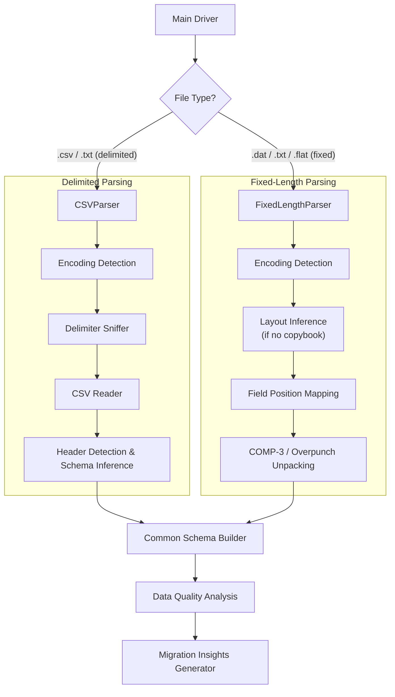

# Flat File Parsing Strategy & Architecture Guide

## 1. Overview
This document outlines the architectural decisions, technical challenges, and implementation strategies for parsing **mainframe-generated flat files** (both **fixed-length** and **delimited/CSV** formats) commonly found in legacy ingestion pipelines. These files are frequently produced or consumed by COBOL, PL/I, or JCL batch processes and represent critical data assets during mainframe modernization and migration to cloud/.NET architectures.

Flat files are typically used for bulk data transfer, staging, or interfacing with external systems. Accurate parsing is essential for reverse engineering data flows, generating schemas, validating data quality, and enabling automated migration to modern formats (e.g., Parquet, JSON, relational tables).

The parsers are designed to be robust, with features like EBCDIC detection, error tracking, and migration insights, integrated into the broader mainframe modernization framework.

---

## 2. File Conventions

| File Type          | Common Extensions       | Description                                                                 | Key Characteristics |
|--------------------|--------------------------|-----------------------------------------------------------------------------|----------------------|
| **Fixed-Length**   | `.dat`, `.txt`, `.fs`, `.flat` | Each record has a fixed number of bytes; fields defined by position and length. | Column-based layout; often EBCDIC-encoded; no delimiters; may require external layouts (e.g., copybooks). |
| **Delimited (CSV)**| `.csv`, `.txt`, `.delim`| Fields separated by a delimiter (usually comma, semicolon, pipe, or tab).   | Variable-length records; often quoted fields; may include headers; handles embedded delimiters. |
| **Mainframe Extract** | `.unl`, `.out`        | Exports from VSAM, DB2 UNLOAD, or third-party utilities.                   | Can be fixed-length or delimited; frequently packed decimal (COMP-3); potential for signed overpunch. |

> **Note:** Mainframe flat files are frequently encoded in **EBCDIC** (e.g., CP037, CP1047) rather than UTF-8/ASCII. The parser must support automatic detection and decoding. Files may lack explicit layouts, requiring inference or external definitions.

---

## 3. Core Parsing Challenges

### A. Encoding Detection (EBCDIC vs ASCII/UTF-8)
*   Mainframe-generated files are often in EBCDIC, while modern extracts may be ASCII/UTF-8.
*   **Challenge:** Incorrect encoding leads to garbled text (e.g., numeric fields appearing as non-printable characters).
*   **Solution:** Prioritize UTF-8 decode; on failure, test common EBCDIC codepages (cp037, cp1047, cp500, cp875). Fall back to chardet if available, or latin-1 with replacement. Track failures via EncodingDetectionError.

### B. Fixed-Length Layout Inference
*   Many fixed-length files lack external layout documentation (copybooks or schemas).
*   **Challenge:** Determining field boundaries, data types, and signed numeric zones (e.g., overpunch, COMP-3).
*   **Solution:**
    *   Use heuristics on sample records to infer likely field lengths and types (e.g., whitespace patterns, type transitions).
    *   Detect common mainframe patterns: zoned decimal (signed overpunch), packed decimal (COMP-3), binary fields.
    *   Validate provided layouts against record lengths; warn on mismatches.

### C. Packed Decimal (COMP-3) and Signed Overpunch
*   **COMP-3 (Packed Decimal):** Stores two digits per byte + sign nibble. Example: `12345C` → +12345 (hex: `12 34 5C`).
*   **Zoned Decimal (Signed Overpunch):** Last byte has sign embedded in high nibble (e.g., `{` = +0, `J` = -1).
*   **Challenge:** Standard string readers cannot interpret these natively; requires binary unpacking.
*   **Solution:** Custom post-processing to unpack COMP-3 and convert overpunch to proper signed integers/decimals. Currently simplified in code; extend with binary handling for full support.

### D. Variable-Length Delimited Files with Embedded Delimiters
*   Fields may contain the delimiter inside quoted strings (e.g., `"Smith, John"`).
*   **Challenge:** Naive splitting corrupts data; inconsistent delimiters across files.
*   **Solution:** Use Python's `csv` module with `Sniffer` for dialect/delimiter detection; respect quoting rules. Fallback to counting common delimiters.

### E. Header Detection and Missing Headers
*   Some files have a header row; others use positional layout only.
*   **Challenge:** Incorrect header assumption leads to wrong column names or schema errors.
*   **Solution:** Heuristic detection: compare first row vs subsequent rows for data type consistency (e.g., first row mostly alphabetic → likely header). Use numeric ratios and pattern matching (e.g., uppercase/underscores).

### F. Error Tracking and Resilience
*   **Challenge:** Files may have truncated lines, invalid encodings, or inconsistent structures.
*   **Solution:** Track warnings and unrecognized content; optional skipping of invalid rows. Raise structured exceptions like CSVParseError, FixedLengthParseError.

---

## 4. Parser Architecture

The solution follows the **registry-based extensible framework** used across all parsers, inheriting from `BaseParser`.

### A. Component Overview


### B. The Parsers

#### 1. CSV/Delimited Parser (`CSVParser`)
*   **Responsibility:** Handle delimited files with optional headers, producing schema, records, quality metrics, and insights.
*   **Key Logic:**
    *   Initialization with configurable max_records, return_all_records, skip_invalid_rows.
    *   Encoding detection with EBCDIC fallback.
    *   Delimiter sniffing using `csv.Sniffer` or fallback counting.
    *   Header detection via heuristics.
    *   Schema inference with type priority: BOOLEAN → INTEGER → DECIMAL → DATE → STRING.
    *   Record parsing with type conversion; Decimal to str for JSON safety.
    *   Data quality: missing values, invalid rows.
    *   Migration insights: fields needing cleansing/transformations.

#### 2. Fixed-Length Parser (`FixedLengthParser`)
*   **Responsibility:** Parse positional files, using provided layouts or inferring them; handle mainframe numerics.
*   **Key Logic:**
    *   Record length determination via most common line length; warn on inconsistencies.
    *   Layout validation or inference (currently simplified; TODO: advanced boundary detection).
    *   Field type inference: NUMERIC/DECIMAL with signed/padding detection.
    *   Record parsing with truncation handling and type conversion.
    *   Data quality: invalid/truncated records.
    *   Migration insights: multi-layout detection, validation needs.

---

## 5. Enterprise Data Mapping Rules

Common mainframe flat file types and their recommended JSON/schema mapping:

| Mainframe Type              | JSON Mapping                                      | Notes / Migration Target             |
| ----------------------------| --------------------------------------------------| ------------------------------------ |
| `PIC X(n)` / Alphanumeric   | `type: "STRING", length: n`                       | → `VARCHAR(n)` or `string`           |
| `PIC 9(n)` (Zoned)          | `type: "INTEGER" or "DECIMAL"`                    | Convert overpunch → signed value     |
| `PIC 9(n) COMP-3`           | `type: "DECIMAL", precision: n, scale: 0`         | Unpack packed bytes                  |
| `PIC S9(n)V99 COMP-3`       | `type: "DECIMAL", precision: n+2, scale: 2`       | Common monetary fields               |
| `BINARY` / `COMP`           | `type: "INTEGER", length: 2/4/8`                  | → `int16/32/64`                      |
| `DATE` (various formats)    | `type: "DATE" or "STRING"`                        | Keep as string initially; normalize later |
| `BIT` fields                | `type: "BOOLEAN" or "BIT_STRING"`                | → `bool` or `bit`                    |

For fixed-length: Include `startPosition`, `length`, `signed`, `padding` in schema.

---

## 6. Stress Testing & Validation

The flat file parsers must reliably handle:

1.  **EBCDIC-encoded files** with correct decoding to readable text.
2.  **COMP-3 packed fields** (e.g., last byte `C` = positive, `D` = negative; extend unpacking logic).
3.  **Signed overpunch** (e.g., `{` = +0, `A` = +1, `J` = -1).
4.  **Quoted delimiters** in CSV (e.g., `"Last, First"`).
5.  **Missing or inconsistent headers**.
6.  **Mixed data types** in same column (triggering quality warnings).
7.  **Very large records** (>10,000 bytes) without memory issues.
8.  **Truncated/inconsistent lines** (skip or raise based on config).
9.  **BOM-stripping** and line-ending normalization.

---

## 7. Implementation Checklist

When integrating flat file support:

1.  [ ] Register parsers in `app/core/parsers/__init__.py` for `csv` and `fixed_length`.
2.  [ ] Add `FLATFILE_CSV` and `FLATFILE_FIXED` to `SourceFileType` enum.
3.  [ ] Ensure file scanner includes common extensions: `*.csv`, `*.txt`, `*.dat`, `*.flat`, `*.fs`.
4.  [ ] Leverage shared `_detect_and_decode` for EBCDIC support.
5.  [ ] Output JSON-serializable values (Decimals → strings, dates → strings).
6.  [ ] Generate meaningful `migrationInsights` (e.g., "Contains COMP-3 fields requiring unpacking").
7.  [ ] Handle exceptions gracefully with logging and tracking (_warnings, _unrecognized).

---

## 8. Final Code Structure Reference

### The Encoding Detector (Shared Across Parsers)
```python
def _detect_and_decode(self, raw_bytes: bytes) -> tuple[str, str]:
    # Try UTF-8 first
    try:
        content = raw_bytes.decode('utf-8')
        return content, 'utf-8'
    except UnicodeDecodeError:
        pass
    
    # Try ASCII
    try:
        content = raw_bytes.decode('ascii')
        return content, 'ascii'
    except UnicodeDecodeError:
        pass
    
    # Try EBCDIC codepages
    for codepage in self.EBCDIC_CODEPAGES:
        try:
            content = raw_bytes.decode(codepage)
            if any(c in content for c in [',', ';', '\t', '|', '\n']):
                return content, codepage
        except (UnicodeDecodeError, LookupError):
            continue
    
    # Fallback to chardet or latin-1
    # ... (full fallback logic)
```

### The Type Inference (Core of Schema Analysis)
```python
def _infer_data_type(self, values: List[str]) -> tuple:
    non_empty_values = [v.strip() for v in values if v.strip()]
    
    if not non_empty_values:
        return "STRING", True
    
    nullable = len(non_empty_values) < len(values)
    
    # Boolean check
    if all(v.upper() in ['TRUE', 'FALSE', 'T', 'F', 'Y', 'N', '0', '1'] for v in non_empty_values):
        return "BOOLEAN", nullable
    
    # Integer check
    if all(self._is_integer(v) for v in non_empty_values):
        return "INTEGER", nullable
    
    # Date check (before decimal to avoid misinterpretation)
    date_count = sum(1 for v in non_empty_values if self._is_date(v))
    if date_count > len(non_empty_values) * 0.8:
        return "DATE", nullable
    
    # Decimal check
    if all(self._is_decimal(v) for v in non_empty_values):
        return "DECIMAL", nullable
    
    return "STRING", nullable
```

### The Record Parser (With Resilience)
```python
def _parse_records(self, headers: List[str], data_rows: List[List[str]]) -> List[Dict[str, Any]]:
    records = []
    
    for row_idx, row in enumerate(data_rows, 1):
        try:
            record = {}
            for idx, header in enumerate(headers):
                value = row[idx].strip() if idx < len(row) else ''
                
                if value == '':
                    record[header] = None
                elif self._is_integer(value):
                    record[header] = int(value)
                elif self._is_decimal(value):
                    record[header] = str(Decimal(value))  # JSON-safe
                else:
                    record[header] = value
            
            records.append(record)
        except Exception as e:
            logger.warning(f"Failed to parse row {row_idx}: {e}")
            self._unrecognized.append({
                "line": row_idx,
                "content": str(row)[:200],
                "error": f"Row parsing failed: {str(e)}"
            })
    
    return records
```

### Fixed-Length Specific: Layout Inference (Simplified)
```python
def _infer_layout(self, lines: List[str], record_length: int) -> List[Dict[str, Any]]:
    # Simplified: Treat as single field; TODO: Advanced detection
    return [(0, record_length)]  # Returns boundaries; extend for real inference
```