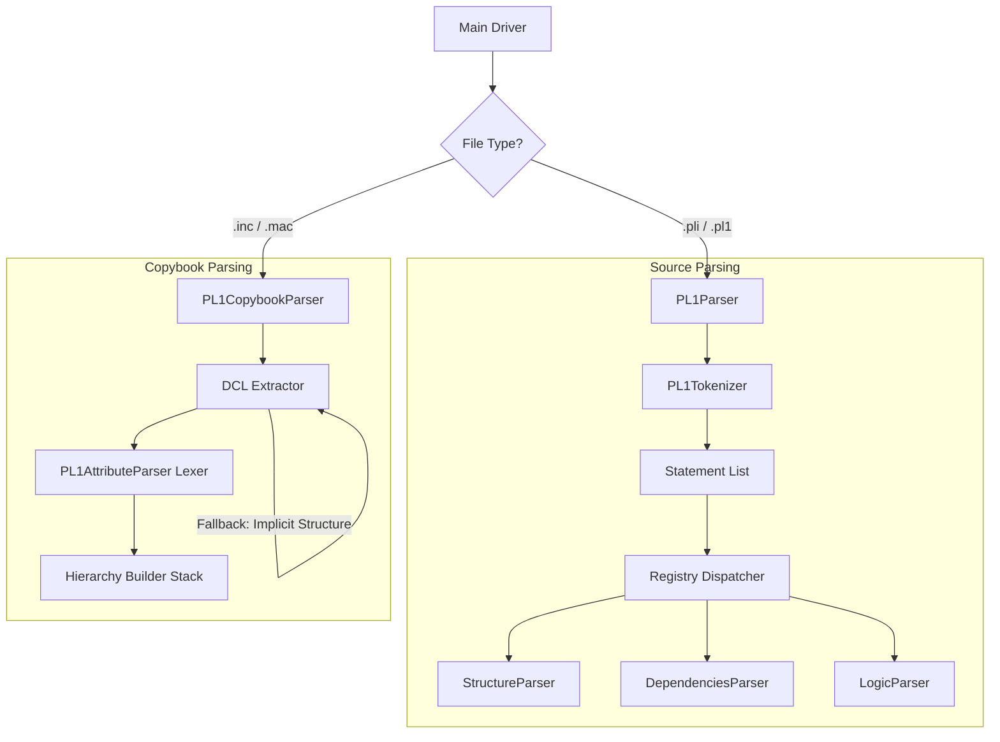

***

# PL/I Parsing Strategy & Architecture Guide

## 1. Overview
This document summarizes the architectural decisions, technical challenges, and implementation strategies for parsing **IBM Enterprise PL/I** source code and include files. Unlike COBOL, which is column-based, PL/I is a free-format, block-structured language, requiring a more sophisticated parsing approach involving state-aware tokenization and scope tracking.

---

## 2. File Conventions

| File Type | Extension | Description | Key Difference from COBOL |
| :--- | :--- | :--- | :--- |
| **Source Code** | `.pli`, `.pl1` | Contains the executable logic (`PROC OPTIONS(MAIN)`). | **Free-format**: Code can start in column 1 or any other column. Ended by semicolons `;`. |
| **Include File** | `.inc` | Reusable code blocks included via `%INCLUDE`. | **Terminology**: COBOL uses "Copybooks" (`.cpy`). PL/I uses "Includes" (`.inc`). |
| **Macros** | `.mac` | Files containing preprocessor logic. | Treated similarly to `.inc` for parsing purposes. |

> **Note:** While a PL/I compiler *can* read a `.cpy` file, standard convention reserves `.cpy` for COBOL `COPY` statements and `.inc` for PL/I `%INCLUDE` statements.

---

## 3. Core Parsing Challenges

### A. The "Semicolon Trap"
PL/I statements end with a semicolon `;`. However, simple splitting by `;` fails in enterprise code:
*   **Strings:** `SQL_STMT = 'SELECT * FROM TBL WHERE COL = '';'';'` contains semicolons inside the string.
*   **Comments:** `/* This is a comment; with a semicolon */`
*   **Solution:** A **State-Aware Tokenizer** is required to iterate character-by-character, tracking state (inside string vs. inside comment) to identify *actual* statement terminators.

### B. Factored Declarations
PL/I allows declaring multiple variables with shared attributes in a grouped syntax.
*   **Code:** `DCL (A, B, C) CHAR(10);`
*   **Meaning:** `A` is `CHAR(10)`, `B` is `CHAR(10)`, `C` is `CHAR(10)`.
*   **Parser Requirement:** The parser must identify the factored list `(A, B, C)`, split them, and apply the attributes to each independently.

### C. Ambiguous Parentheses & Implicit Arrays
Parentheses in PL/I attributes are context-dependent and heavily overloaded.
*   `CHAR(5)` -> **Length**
*   `DIM(5)` -> **Array Dimension**
*   `A(5)` -> **Implicit Array Dimension** (Dimension appears before Type)
*   **Solution:** Regex is insufficient. A **Lexer (Attribute Parser)** is needed to tokenize the attribute string and consume parentheses based on the preceding keyword or context.

### D. Implicit Structure Definitions (No `DCL`)
Many include files define a structure without the `DCL` or `DECLARE` keyword, assuming the importer will provide it.
*   **Code:** `1 MASTER_REC, 3 FIELD A...`
*   **Challenge:** Regex looking for `DCL ... ;` will return empty results.
*   **Solution:** A **Fallback Strategy** in the parser. If no explicit `DCL` is found, check if the file content starts with a numeric Level Number and parse the entire file body as a structure.

### E. Circular References (Recursion Error)
Data structures are doubly linked (Parent <-> Child).
*   **Challenge:** Using `dataclasses.asdict()` causes a `RecursionError` because it traverses the `_parent` link infinitely.
*   **Solution:** Use a **Manual `to_dict` method** that explicitly excludes the `_parent` field and internal metadata.

---

## 4. Parser Architecture

The solution uses a **Registry-based Extensible Architecture**.

### A. Component Diagram


### B. The Parsers

#### 1. PL/1 Source Parser (`PL1Parser`)
*   **Responsibility:** Extracts Program ID, Nested Procedures, SQL, Calls, and Logic flow.
*   **Key Logic:**
    *   **Stack-based Scope Tracking:** Pushes `PROC` names onto a stack when entering, pops when `END` is found. This correctly maps nested procedures (e.g., `CALC_INTEREST` inside `MORTGAGE_CALC`).
    *   **Robust Tokenization:** Handles preprocessor statements (`%INCLUDE`) and multi-line SQL/CICS blocks safely.

#### 2. PL/1 Copybook Parser (`PL1CopybookParser`)
*   **Responsibility:** Extracts Data Declarations (`DCL`) and builds a hierarchical JSON tree.
*   **Key Logic:**
    *   **Attribute Lexing:** A custom loop that consumes tokens to distinguish between `CHAR(5)` (Length) and `DIM(5)` (Array).
    *   **Byte Alignment Heuristics:** Calculates storage size for IBM Mainframes:
        *   `FIXED BIN(15)` -> 2 Bytes
        *   `FIXED BIN(31)` -> 4 Bytes
        *   `POINTER` -> 4 Bytes
    *   **Factoring Support:** Expands `DCL (X,Y) BIN;` into two distinct field objects.
    *   **Implicit Structure Fallback:** Detects files starting with Level numbers.

---

## 5. Enterprise Data Mapping Rules

When parsing attributes, the following mapping rules are applied for JSON output:

| PL/I Attribute | JSON Mapping | Byte Size Logic (approx) |
| :--- | :--- | :--- |
| `CHAR(n)` | `type: "CHAR", length: n` | `n` bytes |
| `BIT(n)` | `type: "BIT", length: n` | `n/8` bytes (aligned) |
| `FIXED BIN(p)` | `type: "BINARY", length: ?` | `p <= 15` -> 2 bytes<br>`p <= 31` -> 4 bytes<br>`p > 31` -> 8 bytes |
| `DEC FIXED(p,s)`| `type: "DECIMAL", length: p, scale: s`| `(p+1)/2` (Packed Decimal) |
| `PTR` / `POINTER`| `type: "POINTER"` | 4 bytes (31-bit addressing) |
| `DIM(x,y)` | `is_array: true, dimension: "x,y"` | N/A |

---

## 6. Stress Testing & Validation

To ensure robustness, the parser must pass the following stress test scenarios:

1.  **Implicit Arrays:** `DCL A (10) CHAR(5);` (Dimension appears *before* type).
2.  **Implicit Structures:** Copybooks containing `1 REC, 3 FLD...` without `DCL`.
3.  **Complex Initialization:** `INIT((5) 0)` (Array repetition factors).
4.  **Nested Structures:** Level 1 containing Level 3, containing Level 5.
5.  **Keyword Confusion:** Variable names that look like keywords (e.g., `DCL IF CHAR(5);`).
6.  **String Escaping:** Source code containing `'IT''S A STRING;'`.

---

## 7. Implementation Checklist

When integrating this into the final application:

1.  [ ] **Enums:** Define `SourceFileType` in `app/core/enums.py` (PLI, PLI_COPYBOOK).
2.  [ ] **Registry:** Register parsers in `app/core/parsers/__init__.py`.
3.  [ ] **Dependencies:** Ensure `app.core.parsers.base` is imported.
4.  [ ] **Encoding:** Use the `_detect_and_decode` method (UTF-8 -> EBCDIC fallback).
5.  [ ] **Extensions:** Configure file scanner to look for `['*.pli', '*.pl1', '*.inc', '*.mac']`.

---

## 8. Final Code Structure Reference

### The Tokenizer (The Heart of the Source Parser)
```python
# Handles semicolons inside strings/comments
def get_statements(content):
    in_string = False
    # ... iterate chars ...
    if char == ';' and not in_string:
        yield statement
```

### The Attribute Lexer (The Heart of the Copybook Parser)
```python
# Distinguishes Length vs Dimension vs Precision
def parse(tokens):
    if token == 'CHAR': 
        # Next paren is Length
    elif token == 'DIM':
        # Next paren is Dimension
    elif token == '(' and no_type_yet:
        # Implicit Dimension
```

### The Manual Serializer (Prevents Recursion)
```python
def to_dict(self):
    # Do NOT use asdict()
    d = { "level": self.level, "name": self.name }
    if self.children:
        d["children"] = [c.to_dict() for c in self.children]
    return d
```