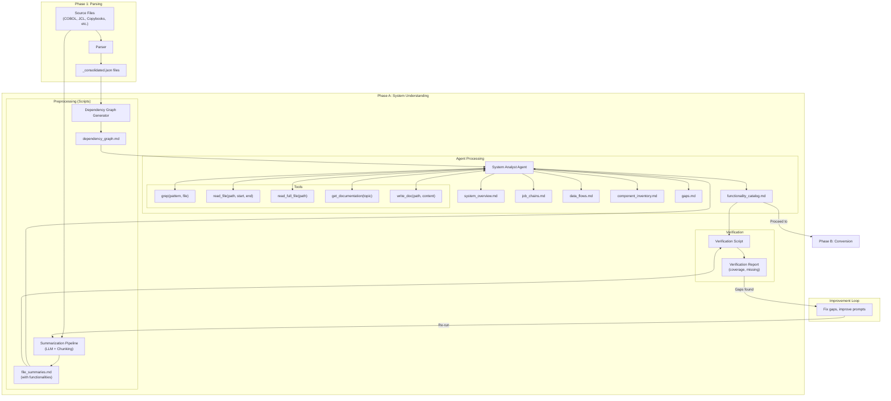

# Phase A: System Understanding

> **Goal**: Understand the mainframe system well enough to convert it to .NET.

---

## Table of Contents

1. [The Problem](#1-the-problem)
2. [What We Need to Understand](#2-what-we-need-to-understand)
3. [Dependencies We Capture](#3-dependencies-we-capture)
4. [Inputs to the Agent](#4-inputs-to-the-agent)
5. [What the Agent Produces](#5-what-the-agent-produces)
6. [Agent Processing Approach](#6-agent-processing-approach)
7. [Verification](#7-verification)
8. [Handling Gaps](#8-handling-gaps)
9. [The Improvement Loop](#9-the-improvement-loop)
10. [Known Limitations](#10-known-limitations)

---

## 1. The Problem

We have a mainframe system with:
- ~60 COBOL programs
- ~231 copybooks  
- ~49 JCL jobs
- ~42 JCL procs
- Various other components (PL/I, REXX, Assembler, IBM utilities)

We need to convert it to .NET.

**Before we convert, we must understand:**
1. What components exist
2. How they relate to each other
3. What each component does (functionalities)
4. How the system works as a whole

### 1.1 Complete Flow Overview



---

## 2. What We Need to Understand

### 2.1 Per Component

For a **program** (COBOL/PL/I):
- What is its purpose?
- What functionalities does it provide?
- What are its key operations?

For a **job** (JCL):
- What is its purpose?
- When does it run?
- What does it depend on?

For a **copybook**:
- What entity does it represent?
- What are its key fields?

### 2.2 System Level

- What is the business purpose of the system?
- What are the major job chains?
- How does data flow through the system?
- What are all the functionalities the system provides?

---

## 3. Dependencies We Capture

These relationships are extracted by the parser and documented in `dependency_graph.md`:

| # | Relationship | Example | Source |
|---|--------------|---------|--------|
| 1 | JCL → Program | PAYJOB02 runs PAYROLL | `EXEC PGM=` |
| 2 | JCL → PROC | PAYJOB02 calls PAYPROC | `EXEC PROC=` |
| 3 | PROC → Program | PAYPROC runs PAYROLL | `EXEC PGM=` in proc |
| 4 | COBOL → Copybook | PAYROLL uses EMPREC | `COPY` statement |
| 5 | COBOL → COBOL (static) | PAYROLL calls CALCTAX | `CALL 'literal'` |
| 6 | COBOL → COBOL (dynamic) | PAYROLL calls WS-PROG | `CALL variable` - flagged |
| 7 | COBOL → PL/I | PAYROLL calls CALCDATE | `CALL` to PL/I program |
| 8 | PL/I → COBOL | PLIPROG calls COBOLPROG | PL/I CALL |
| 9 | REXX → Program | REXXSCRIPT calls COBOL | ADDRESS LINKPGM |
| 10 | Program → Table | PAYROLL reads EMPLOYEE | `EXEC SQL` |
| 11 | Program → File | PAYROLL writes PAYFILE | File operations |
| 12 | JCL → File | PAYJOB02 uses EMPFILE | DD statements |
| 13 | Job → Job | PAYJOB02 after PAYJOB01 | CA-7 or file inference |

### 3.1 Dynamic CALLs

Dynamic CALLs are detected and resolved **during the parsing phase**:

1. **Parser detects** `CALL WS-PROG-NAME` (variable instead of literal)
2. **Parser searches** same file for `MOVE 'PROGNAME' TO WS-PROG-NAME`
3. **If resolvable**: Parser adds resolved target to dependencies
4. **If not resolvable**: Parser marks as dynamic with unknown target

In dependency_graph.md:
```markdown
## Dynamic CALLs (unresolved)
| Program | Variable | Line | Possible Values |
|---------|----------|------|-----------------|
| PAYROLL | WS-UTIL-PROG | 3456 | Unknown |
```

Unresolved dynamic calls become gaps.

### 3.2 IBM and Third-Party Utilities

- **Common IBM utilities** (SORT, IEBGENER, IDCAMS): LLM knows these
- **Uncommon utilities**: Use RAG with documentation
- **Unknown utilities**: Document as gap

### 3.3 Complex Scenarios and Handling Strategies

These scenarios require specific handling during parsing:

#### 3.3.1 Symbolic Parameters in JCL

**What**: `EXEC PGM=&PGMNAME` where program name is a variable.

**Handling**:
1. Parser checks PROC definition for parameter defaults: `PGMNAME=PAYROLL`
2. Parser checks SET statements: `// SET PGMNAME=PAYROLL`
3. Parser checks JCL calling the PROC for parameter override
4. If resolved → add to dependencies with resolved value
5. If not resolved → add to Dynamic CALLs section with parameter name

#### 3.3.2 Nested COPY Statements

**What**: Copybook A contains `COPY B`, creating a dependency chain.

**Handling**:
1. Parser recursively follows COPY statements
2. Build copybook dependency tree: A → B → C
3. Include all nested copybooks in Program → Copybook mapping
4. If circular COPY detected → flag as error

#### 3.3.3 COPY REPLACING

**What**: `COPY EMPREC REPLACING ==:PREFIX:== BY ==EMP==`

**Handling**:
1. Parser notes the REPLACING clause
2. Store in copybook usage: `{copybook: "EMPREC", replacements: [{":PREFIX:": "EMP"}]}`
3. Summarization considers that field names are modified
4. No special gap handling needed - just documentation

#### 3.3.4 Conditional Job Steps

**What**: Steps that only run under certain conditions.

```jcl
//STEP02 EXEC PGM=BACKUP,COND=(0,NE,STEP01)
//       IF RC > 4 THEN
//ERRJOB EXEC PGM=ERRHANDL
//       ENDIF
```

**Handling**:
1. Parser extracts conditions with each step
2. Dependency graph includes condition: `STEP02 runs BACKUP (if STEP01 RC=0)`
3. Agent considers conditional execution when analyzing job chains
4. Job chain documentation notes: "ERRHANDL only runs if error"

#### 3.3.5 Dynamic SQL

**What**: SQL constructed at runtime.

```cobol
MOVE 'SELECT * FROM ' TO WS-SQL.
STRING WS-SQL WS-TABLE-NAME INTO WS-SQL.
EXEC SQL EXECUTE IMMEDIATE :WS-SQL END-EXEC.
```

**Handling**:
1. Parser detects `EXECUTE IMMEDIATE` or `PREPARE`/`EXECUTE`
2. Flag as dynamic SQL with variable name
3. Try to resolve: Search for STRING/MOVE populating the variable
4. If table name found → add to dependencies
5. If not resolvable → gap: "Dynamic SQL, tables unknown"

#### 3.3.6 Computed GO TO

**What**: Jump target determined at runtime.

```cobol
GO TO PARA-A PARA-B PARA-C DEPENDING ON WS-INDEX.
```

**Handling**:
1. Parser notes all possible targets: [PARA-A, PARA-B, PARA-C]
2. Control flow is non-linear - all branches are possible
3. Summarization includes all paragraphs that could execute
4. No gap needed - just complex control flow

#### 3.3.7 PERFORM THRU

**What**: Execute a range of paragraphs.

```cobol
PERFORM 100-START THRU 300-END.
```

**Handling**:
1. Parser identifies paragraph range
2. All paragraphs between START and END are part of this PERFORM
3. Chunking groups these paragraphs together (don't split in middle)
4. Summarization treats as one logical unit

#### 3.3.8 Instream Procedures

**What**: PROC defined within JCL rather than in PROCLIB.

```jcl
//MYPROC PROC
//STEP1  EXEC PGM=MYPROG
//       PEND
//RUNJOB EXEC MYPROC
```

**Handling**:
1. Parser detects `PROC`...`PEND` block
2. Parse instream proc same as external proc
3. Add to PROC → Program dependencies
4. Note in summary: "Instream proc (not in PROCLIB)"

---

## 4. Inputs to the Agent

We prepare these **before** the agent runs:

### 4.1 dependency_graph.md

Built by our code from parser outputs. Contains all dependency relationships.

```markdown
# Dependency Graph

## JCL → Program
| Job | Step | Program |
|-----|------|---------|
| PAYJOB01 | STEP1 | LOADDATA |
| PAYJOB02 | STEP1 | PAYROLL |

## JCL → PROC
| Job | Step | Proc |
|-----|------|------|
| RPTJOB01 | STEP1 | RPTPROC |

## PROC → Program
| Proc | Step | Program |
|------|------|---------|
| RPTPROC | STEP1 | GENRPT |

## Program → Program (CALL)
| Caller | Called | Type |
|--------|--------|------|
| PAYROLL | CALCTAX | static |
| PAYROLL | CALCBEN | static |
| PAYROLL | WS-UTIL | dynamic |

## Program → Copybook
| Program | Copybooks |
|---------|-----------|
| PAYROLL | EMPREC, PAYREC, TAXRATES |

## Program → Table
| Program | Table | Operations |
|---------|-------|------------|
| PAYROLL | EMPLOYEE | SELECT |
| PAYROLL | PAY_HISTORY | INSERT |

## Program → File  
| Program | File | Operation |
|---------|------|-----------|
| PAYROLL | EMPFILE | READ |
| PAYROLL | PAYFILE | WRITE |

## Job → Job
| Job | Depends On | Reason |
|-----|------------|--------|
| PAYJOB02 | PAYJOB01 | File dependency |
```

### 4.2 file_summaries.md

Created via **chunked rolling summarization**:
- Split file into chunks
- Summarize chunk 1
- Summarize chunk 2 + summary of chunk 1
- Continue until final summary

Each summary lists **functionalities** (source of truth for verification):

```markdown
# File Summaries

## COBOL Programs

### PAYROLL.cbl
**Purpose**: Calculates employee payroll - processes time records, 
applies pay rates, calculates taxes and deductions.

**Functionalities**:
- Calculate gross pay from hours and rate
- Apply overtime rules (1.5x for hours > 40)
- Calculate tax withholding (federal and state)
- Calculate benefit deductions
- Generate payment record

**Key Operations**:
- Reads employee master file
- Calls CALCTAX for tax calculation
- Calls CALCBEN for benefit calculation
- Writes payment records

**Notes**:
- California has special overtime logic (>8 hrs/day)
- Uses COMP-3 for monetary calculations

---

### CALCTAX.cbl
**Purpose**: Calculates federal and state tax withholding.

**Functionalities**:
- Look up tax bracket based on income
- Calculate federal tax withholding
- Calculate state tax withholding

**Key Operations**:
- Uses tax bracket tables
- Applies marginal rates
- Returns calculated tax amount

---

## JCL Jobs

### PAYJOB02.jcl
**Purpose**: Main payroll calculation job.

**Functionalities**:
- Execute payroll processing
- Coordinate data flow between files

**Schedule**: Daily at 02:00 AM
**Depends On**: PAYJOB01 (data load)

---

## Copybooks

### EMPREC.cpy
**Purpose**: Employee master record layout.
**Entity**: Employee
**Key Fields**: EMP-ID, EMP-NAME, HOURLY-RATE, DEPT-CODE, STATE-CODE

---

## REXX Scripts

### DISTRIBUTE.rexx
**Purpose**: Distributes generated reports to stakeholders.

**Functionalities**:
- Send reports via email
- Archive to shared drive

**Classification**: CONVERT (used in production batch)

### EDITPADS.rexx
**Purpose**: Developer edit macro.
**Classification**: IGNORE (developer tool, not production)
```

### 4.3 Agent Tools

| Tool | What It Does |
|------|--------------|
| `grep(pattern, file)` | Search files for patterns, find relevant sections |
| `read_file(path, start, end)` | Read specific line range from a file |
| `read_full_file(path)` | Read entire file into context (for small files) |
| `get_documentation(topic)` | Retrieve documentation via RAG (COBOL syntax, JCL reference, IBM utilities, etc.) |
| `write_doc(path, content)` | Write output document |

The agent decides how to use these based on what it needs. It can load files fully or search for specific sections.

---

## 5. What the Agent Produces

The agent reads dependency graph + summaries and produces documents that give a complete understanding of the system.

### 5.1 system_overview.md

High-level description of what the system does:

```markdown
# System Overview

## Business Purpose
Payroll processing system for ~50,000 employees across 12 states.
Handles daily pay calculation, tax withholding, benefit deductions,
and generates bank transfer files for direct deposit.

## Key Business Processes
1. **Daily Payroll**: Load data → Calculate pay → Generate reports → Bank file
2. **Benefits Processing**: Calculate and apply benefit deductions
3. **Month-End**: Generate summaries, archive history

## System Boundaries
- **Inputs**: HR data feed, tax tables, benefit elections
- **Outputs**: Bank files, tax reports, pay stubs, management reports
```

### 5.2 job_chains.md

How batch processing flows:

```markdown
# Job Chains

## Chain 1: Daily Payroll
```
PAYJOB01 (Load HR Data)
    ↓
PAYJOB02 (Calculate Payroll)
    ↓
PAYJOB03 (Generate Reports)
    ↓
PAYJOB04 (Create Bank File)
```

**Trigger**: Daily at 01:00 AM
**Duration**: ~2 hours
**Business Purpose**: Process daily pay for all employees

## Chain 2: Benefits Processing
...
```

### 5.3 functionality_catalog.md

All business functionalities the system provides:

```markdown
# Functionality Catalog

## Payroll Domain

### F001: Calculate Gross Pay
**Implemented By**: PAYROLL.cbl
**Triggered By**: PAYJOB02
**Description**: Calculates gross pay from hours worked and pay rate.
Applies overtime multiplier for hours exceeding 40/week.

### F002: Calculate Tax Withholding  
**Implemented By**: CALCTAX.cbl
**Called By**: PAYROLL, BENEFITS, MTHEND
**Description**: Calculates federal and state tax withholding based on
income and filing status using tax bracket tables.

### F003: Calculate Benefit Deductions
**Implemented By**: CALCBEN.cbl
**Called By**: PAYROLL
**Description**: Calculates deductions for health insurance, retirement,
and other elected benefits.

## HR Domain

### F004: Load Employee Data
**Implemented By**: LOADDATA.cbl
**Triggered By**: PAYJOB01
**Description**: Reads HR input file and updates employee master records.

...
```

### 5.4 data_flows.md

Where data comes from and goes to:

```markdown
# Data Flows

## External Inputs
| Source | File | Consumed By | Description |
|--------|------|-------------|-------------|
| HR System | HRINPUT | LOADDATA | Daily employee updates |
| Tax Authority | TAXRATES | CALCTAX | Annual tax tables |

## Internal Data
| File | Produced By | Consumed By | Description |
|------|-------------|-------------|-------------|
| EMPFILE | LOADDATA | PAYROLL, BENEFITS | Employee master |
| PAYFILE | PAYROLL | PAYRPT, BANKFMT | Payment records |

## External Outputs  
| File | Produced By | Destination | Description |
|------|-------------|-------------|-------------|
| BANKFILE | BANKFMT | Bank | Direct deposit file |
| PAYRPT | PAYRPT | Finance | Payroll summary report |
```

### 5.5 component_inventory.md

Status of all components:

```markdown
# Component Inventory

## Programs (60 total)
| Program | Type | Status | Notes |
|---------|------|--------|-------|
| PAYROLL | COBOL | Understood | Core payroll engine |
| CALCTAX | COBOL | Understood | Tax calculation |
| VENDORCALC | Unknown | Gap | No source code |
| ...

## Copybooks (231 total)
| Copybook | Entity | Status |
|----------|--------|--------|
| EMPREC | Employee | Understood |
| PAYREC | Payment | Understood |
| ...

## Jobs (49 total)
| Job | Chain | Status |
|-----|-------|--------|
| PAYJOB01 | Daily Payroll | Understood |
| PAYJOB02 | Daily Payroll | Understood |
| ...
```

### 5.6 gaps.md

What we don't understand:

```markdown
# Gaps

## Gap 1: VENDORCALC
**What**: Program called by PAYROLL
**Why Unknown**: No source code in provided files
**What Would Fix It**: Source code or documentation of inputs/outputs

## Gap 2: Dynamic CALL in PAYROLL line 3456
**What**: CALL WS-UTIL-PROG where target is variable
**Why Unknown**: Could not determine value from static analysis
**What Would Fix It**: Runtime trace or business knowledge of possible targets

## Gap 3: HRINPUT file format  
**What**: Input file read by LOADDATA
**Why Unknown**: Copybook not provided
**What Would Fix It**: Interface specification from HR team
```

---

## 6. Agent Processing Approach

### 6.1 Iterative Processing (Not Full Context Load)

The agent does NOT load all summaries into context at once. It processes iteratively:

```
1. LOAD dependency_graph.md into context (small, acts as index/map)

2. PROCESS BY DOMAIN:
   - Read summaries for payroll-related programs
   - Write functionality_catalog.md entries for payroll domain
   - Read summaries for HR-related programs  
   - Write functionality_catalog.md entries for HR domain
   - Continue for each domain...

3. FOR JOB CHAINS:
   - Read job summaries for Chain 1
   - Write job_chains.md section for Chain 1
   - Repeat for each chain

4. SYNTHESIZE OVERVIEW:
   - Read what was written so far
   - Write system_overview.md as high-level synthesis
```

### 6.2 Context Management

| What | How Agent Uses It |
|------|-------------------|
| **dependency_graph.md** | Kept in context as map/index (it's small) |
| **file_summaries.md** | Read sections on-demand using tools |
| **Output documents** | Write incrementally, read back when needed |

### 6.3 Tools for Context Management

The agent uses tools to read what it needs:
- `grep(pattern, file)` - Find relevant sections
- `read_file(path, start, end)` - Read specific sections
- `read_full_file(path)` - Only for small files

This allows the agent to process large inputs without context overflow.

---

## 7. Verification

### 7.1 The Approach

**Summaries list functionalities** → **Agent produces functionality catalog** → **Verify all functionalities are captured**

### 7.2 What We Verify

| Check | How |
|-------|-----|
| All functionalities captured | Compare functionalities in summaries vs functionality catalog |
| All programs covered | Every program appears in component inventory |
| All gaps documented | Unknown items have entries in gaps.md |

### 7.3 Verification Process

```
1. Extract all functionalities from file_summaries.md
   - PAYROLL.cbl: [Calculate gross pay, Apply overtime, Calculate tax, ...]
   - CALCTAX.cbl: [Look up bracket, Calculate federal, Calculate state]
   - ...

2. Extract all functionalities from functionality_catalog.md
   - F001: Calculate Gross Pay (PAYROLL)
   - F002: Calculate Tax Withholding (CALCTAX)
   - ...

3. Compare
   - Every functionality in summaries should appear in catalog
   - Missing = potential gap in agent output

4. Report
   - Covered: 45/47 functionalities
   - Missing: 2 functionalities
   - Gaps documented: 3
```

### 7.4 What Verification Does NOT Do

- **Does not verify summary accuracy** - We assume summaries are correct
- **Does not verify business logic** - That requires domain expertise
- **Only checks completeness** - Did we capture everything from summaries?

---

## 8. Handling Gaps

### 8.1 A Gap Has Three Parts

| Field | Description |
|-------|-------------|
| **What** | What we don't understand |
| **Why Unknown** | Why we can't understand it |
| **What Would Fix** | What information would resolve it |

### 8.2 Common Gap Types

| Gap Type | Why | How to Fix |
|----------|-----|------------|
| Missing source | Third-party code | Get from vendor |
| Dynamic CALL | Variable target | Static analysis or runtime trace |
| Undocumented logic | Complex code | Business analyst review |
| External interface | No spec | Get interface documentation |
| Cross-language | Assembler module | Document interface only |

### 8.3 Gap Resolution

1. **Get the information** needed to fix the gap
2. **Update inputs** (add to summaries or dependency graph)
3. **Re-run agent**
4. **Verify** gap is no longer in gaps.md

---

## 9. The Improvement Loop

### 9.1 The Process

```
┌─────────────────────────────────────────────────────────┐
│  RUN 1                                                  │
│  Agent reads: dependency_graph.md + file_summaries.md   │
│  Agent produces: All output documents                   │
│  Verification: Compare functionalities                  │
│  Result: 5 gaps, 2 missing functionalities              │
└─────────────────────────────────────────────────────────┘
                          │
                          ▼
┌─────────────────────────────────────────────────────────┐
│  ANALYZE & IMPROVE                                      │
│  - Fix gaps (get missing documentation)                 │
│  - Improve prompts if summaries were poor               │
│  - Update dependency graph if parser missed something   │
└─────────────────────────────────────────────────────────┘
                          │
                          ▼
┌─────────────────────────────────────────────────────────┐
│  RUN 2                                                  │
│  Agent reads: Updated inputs                            │
│  Agent produces: Updated documents                      │
│  Verification: Compare again                            │
│  Result: 2 gaps, 0 missing functionalities              │
└─────────────────────────────────────────────────────────┘
                          │
                          ▼
                       REPEAT
```

### 9.2 When Are We Done?

1. **All functionalities from summaries appear in catalog**
2. **All programs appear in component inventory**  
3. **Remaining gaps are accepted** (customer confirms they can't provide more info)
4. **Human has reviewed** the output documents

---

## 10. Known Limitations

These are acknowledged limitations of this approach:

### 10.1 Circular Verification

**Issue**: We verify agent output against summaries, but summaries are also LLM-generated.

```
Summaries (LLM) → Agent (LLM) → Verification against Summaries
```

We are verifying LLM output against LLM output. If summaries are wrong, verification still passes.

**Mitigation**: Accept this limitation. Errors will surface during conversion phase. Improve summaries based on conversion feedback.

### 10.2 No Ground Truth for Summary Quality

**Issue**: We have no way to automatically verify if summaries accurately describe the code.

- Parser gives structural facts (calls, files) - verifiable
- LLM gives meaning (purpose, functionality) - not automatically verifiable

**Mitigation**: Trust LLM summaries for now. During development, spot-check sample summaries. Improve prompts based on findings.

### 10.3 Verification Catches Omissions, Not Errors

**Issue**: We check if all functionalities from summaries appear in catalog, but not if those functionalities are correctly described.

| Scenario | Summary | Agent Output | Verification |
|----------|---------|--------------|---------------|
| Correct | "Calculates payroll" | F001: Calculate Payroll | ✅ Pass |
| Wrong | "Calculates billing" | F001: Calculate Billing | ✅ Pass (but wrong!) |
| Omission | Missing functionality | Missing in catalog | ❌ Fail (caught) |

**Why this matters**: We catch when things are MISSING (omissions). We don't catch when things are INCORRECTLY DESCRIBED (errors).

**Mitigation**: Focus on omissions. Errors will be caught during conversion when code doesn't behave as expected.

### 10.4 Post-Deployment Self-Verification

**Issue**: Human review is only available during development. Once deployed, the tool must self-validate.

**Self-checks the tool performs (no human needed)**:
1. **Coverage check**: All programs in parser output have entries in functionality catalog
2. **Consistency check**: All dependencies in catalog match dependency graph
3. **Completeness check**: All functionalities from summaries appear in catalog
4. **Structure check**: All output documents have required sections

**What CANNOT be self-verified**:
- Is the summary accurate? (requires domain knowledge)
- Is the business logic correct? (requires specifications)

**Mitigation**:
- During development, extensively test on sample systems with known behavior
- Build comprehensive self-checks for everything that can be automated
- Accept that semantic correctness cannot be guaranteed without ground truth
- Errors in understanding will surface during conversion phase and feed back to improve prompts

---

## Appendix A: Key Decisions

| Decision | Rationale |
|----------|-----------|
| Parser for dependencies only | Parser may not be 100% accurate, use for relationships |
| Summaries list functionalities | Creates verifiable source of truth |
| No partial agent runs | Run full, verify, improve, run again |
| Summaries assumed correct | Don't auto-verify summary quality |
| Verification = functionality coverage | Simple, objective check |
| Gaps have What/Why/Fix | Actionable format |
| Iterative processing | Agent doesn't load everything at once |

---

## Appendix B: Implementation Requirements

Everything needed to implement this plan:

### B.1 Components to Build

| Component | Type | Description |
|-----------|------|-------------|
| **Dependency Graph Generator** | Script | Reads parser JSON outputs, generates `dependency_graph.md` |
| **Summarization Pipeline** | LLM + Script | Chunked rolling summarization of source files |
| **Understanding Agent** | LLM Agent | Reads inputs, produces understanding documents |
| **Verification Script** | Script | Compares functionalities in summaries vs catalog |

### B.2 Dependency Graph Generator

**Input**: `_consolidated.json` files from parser (cobol, jcl, copybook, etc.)

**Output**: `dependency_graph.md`

**Logic**:
```python
# Pseudocode
def generate_dependency_graph():
    # Read all parser outputs
    cobol_data = read_json("cobol/_consolidated.json")
    jcl_data = read_json("jcl/_consolidated.json")
    ...
    
    # Extract relationships
    jcl_to_program = extract_exec_pgm(jcl_data)
    jcl_to_proc = extract_exec_proc(jcl_data)
    program_to_copybook = extract_copy_statements(cobol_data)
    program_to_program = extract_calls(cobol_data)
    program_to_table = extract_sql(cobol_data)
    program_to_file = extract_file_ops(cobol_data)
    jcl_to_file = extract_dd_statements(jcl_data)
    job_to_job = infer_job_dependencies(jcl_data, ca7_data)
    
    # Generate markdown
    write_markdown("dependency_graph.md", all_relationships)
```

### B.3 Summarization Pipeline

**Input**: Source files (COBOL, JCL, copybooks, etc.)

**Output**: `file_summaries.md`

#### Which Files Need Chunking?

| File Type | Typical Size | Chunking Needed? |
|-----------|--------------|------------------|
| COBOL programs | 1K-10K+ lines | ✅ Yes - structure-aware |
| PL/I programs | 500-5K lines | ✅ Maybe - if large |
| JCL jobs | 50-500 lines | ❌ No - fits in context |
| JCL procs | 20-200 lines | ❌ No - small |
| Copybooks | 10-200 lines | ❌ No - small |
| REXX scripts | 50-500 lines | ❌ No - usually small |

#### Structure-Aware Chunking for COBOL

Don't use fixed line counts. Chunk at logical boundaries:

```
COBOL Structure:
├── IDENTIFICATION DIVISION → Chunk 1
├── ENVIRONMENT DIVISION → Chunk 2
├── DATA DIVISION (may be large)
│   ├── FILE SECTION → Chunk 3
│   ├── WORKING-STORAGE SECTION → Chunk 4 (split if >500 lines)
│   └── LINKAGE SECTION → Chunk 5
└── PROCEDURE DIVISION
    ├── Paragraphs 000-099 → Chunk 6
    ├── Paragraphs 100-199 → Chunk 7
    └── ... (split at paragraph boundaries)
```

The parser already extracts division/section/paragraph boundaries. Use this info.

#### Summarization Process

**For small files (no chunking needed)**:
```
1. Send entire file to LLM
2. Get summary with functionalities
3. Write to file_summaries.md
```

**For large files (COBOL, large PL/I)**:
```
1. Split into chunks at logical boundaries
2. Summarize chunk 1 → summary_1
3. Summarize chunk 2 + summary_1 → summary_2
4. Continue until final summary
5. Extract functionalities from final summary
6. Write to file_summaries.md
```

**Prompt Template (to be iterated)**:
```
You are summarizing a COBOL program.

Source code chunk:
{chunk}

Previous summary (if any):
{previous_summary}

Provide:
1. Purpose: What does this code do? (1-2 sentences)
2. Functionalities: List discrete business capabilities (as bullet points)
3. Key Operations: What transformations/processes does it perform?
4. Notes: Any special considerations

Output format:
Purpose: ...
Functionalities:
- ...
- ...
Key Operations:
- ...
Notes:
- ...
```

### B.4 Understanding Agent

**Inputs**:
- `dependency_graph.md` (in context as map)
- `file_summaries.md` (accessed via tools)

**Outputs**:
- `system_overview.md`
- `job_chains.md`
- `functionality_catalog.md`
- `data_flows.md`
- `component_inventory.md`
- `gaps.md`

**Agent System Prompt (to be iterated)**:
```
You are a system analyst understanding a mainframe system for .NET conversion.

You have access to:
1. dependency_graph.md - Shows all relationships between components
2. file_summaries.md - Contains purpose and functionalities for each file

Your task:
1. Understand the system as a whole
2. Produce documentation that would allow someone to understand what to convert

Use the available tools to read summaries as needed.
Process iteratively - don't try to load everything at once.

Output the following documents:
- system_overview.md: High-level business purpose
- job_chains.md: How batch processing flows
- functionality_catalog.md: All business functionalities
- data_flows.md: How data moves through the system
- component_inventory.md: Status of all components
- gaps.md: What we don't understand
```

**Domain Grouping Strategy**:

Domains are determined by job chains:

```
1. Group programs by job chain:
   - Programs in PAYJOB01-04 → "Payroll" domain
   - Programs in BENEJOB01-02 → "Benefits" domain
   - Programs in HRJOB01-03 → "HR" domain

2. Shared utilities (used across chains):
   - CALCTAX used by Payroll + Benefits → "Shared/Tax" 
   - FMTDATE used everywhere → "Shared/Utilities"

3. Orphan programs (not in any job):
   - Group by naming pattern or leave as "Uncategorized"
```

The agent uses dependency_graph.md (Job → Program relationships) to determine groupings.

### B.5 Verification Script

**Input**:
- `file_summaries.md` (source of truth)
- `functionality_catalog.md` (agent output)

**Output**: Verification report

**Logic**:
```python
# Pseudocode
def verify():
    # Extract functionalities from summaries
    summary_funcs = parse_functionalities_from_summaries("file_summaries.md")
    # Example: {"PAYROLL.cbl": ["Calculate gross pay", "Apply overtime", ...]}
    
    # Extract functionalities from catalog
    catalog_funcs = parse_functionalities_from_catalog("functionality_catalog.md")
    # Example: ["F001: Calculate Gross Pay", "F002: Apply Overtime", ...]
    
    # Compare (fuzzy matching since wording may differ)
    missing = []
    for file, funcs in summary_funcs.items():
        for func in funcs:
            if not fuzzy_match(func, catalog_funcs):
                missing.append({"file": file, "functionality": func})
    
    # Report
    print(f"Total functionalities in summaries: {count(summary_funcs)}")
    print(f"Total functionalities in catalog: {len(catalog_funcs)}")
    print(f"Missing: {len(missing)}")
    for m in missing:
        print(f"  - {m['file']}: {m['functionality']}")
```

### B.6 File Formats

**dependency_graph.md structure**:
```markdown
# Dependency Graph

## JCL → Program
| Job | Step | Program |
...

## JCL → PROC
...

(one section per relationship type)
```

**file_summaries.md structure**:
```markdown
# File Summaries

## COBOL Programs

### PROGRAM_NAME.cbl
**Purpose**: ...
**Functionalities**:
- Functionality 1
- Functionality 2
**Key Operations**:
- ...
**Notes**:
- ...

---

(repeat for each file)

## JCL Jobs
...

## Copybooks
...
```

### B.7 Open Implementation Decisions

| Decision | Options | Recommendation |
|----------|---------|----------------|
| **Chunk size for summarization** | 300, 500, 1000 lines | Start with 500, adjust based on quality |
| **Fuzzy matching for verification** | Exact, contains, semantic | Start with substring matching |
| **Agent framework** | LangGraph, custom, other | TBD based on team preference |
| **Storage for outputs** | Files, database | Files (simpler) |

### B.8 Iteration Plan

**Phase 1: Build Pipeline**
- [ ] Build dependency graph generator
- [ ] Build summarization pipeline (basic prompt)
- [ ] Build verification script
- [ ] Test on sample files

**Phase 2: Agent Development**
- [ ] Define agent with system prompt
- [ ] Implement tools (grep, read_file, write_doc)
- [ ] Run on sample data
- [ ] Review outputs

**Phase 3: Iteration**
- [ ] Analyze gaps and verification failures
- [ ] Improve summarization prompts
- [ ] Improve agent prompts
- [ ] Repeat until acceptable coverage

---

*Understanding is complete when all functionalities are captured, gaps are documented, and we can proceed to conversion.*
